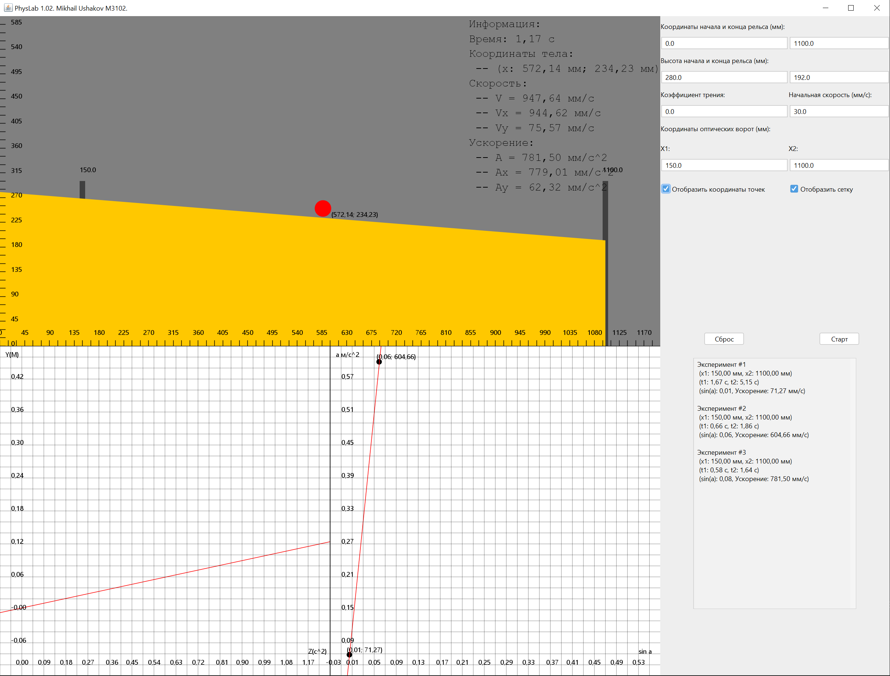

#Моделирование лабораторной работы 1.02 по физике.
##Предмет: "Специальные разделы физики"

Пример работы:

Программа позволяет моделировать процесс скатывания тела по наклонной плоскости.
Пользователь может задать координаты начала и конца рельса, высоту начала и конца рельса, коэффициент трения а также начальную скорость тела.

Также в программе есть возможность устанавливать положение двух оптических ворот, замеряющих время прохождения телом этих ворот.